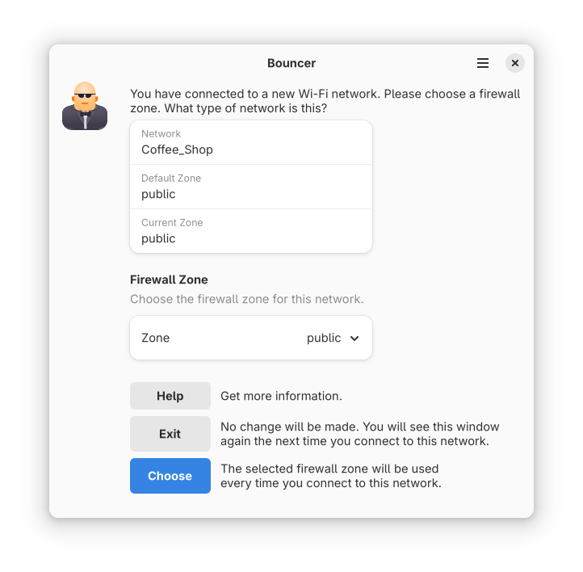

# Bouncer

Bouncer is an application to help you choose the correct firewall zone for wireless connections. When you connect to a new network, Bouncer will open a window prompting you for what kind of network (eg home, public, work) it is. When you choose the network type, it is associated with that network and automatically used in the future.

[NetworkManager](https://networkmanager.dev/) and [firewalld](https://firewalld.org/) are required. If you don't use those, you can't use Bouncer. Fedora uses both by default. Other distributions may not.

Additional setup is required after installation. See the applicable section for your distribution.

## Installation

Install from Flathub (pending).

## Setup

Unlike most Flatpak applications, Bouncer needs to start when you log in. So autostart needs to be configured. Bouncer can do this for you, so just start it manually the first time. After that, it will start automatically when you log in. This must be done for each user on the system.

If you want to enable autostart system-wide (ie for all users), you have to do that manually. Copy the `.desktop` file to the system-wide `autostart` directory. (eg `sudo cp /var/lib/flatpak/exports/share/applications/io.github.justinrdonnelly.bouncer.desktop /etc/xdg/autostart/`).

Because Bouncer requires NetworkManager and firewalld, and changing firewall zones sometimes requires root (depending on polkit configuration), there may be additional setup required. The table below shows relevant information for various distributions.

| Distribution | NetworkManager by default | firewalld by default | polkit OK for admin users by default | polkit OK for regular users by default |
| ------------ | ----------------------------- | ------------------------ | -------------------------------------------- | ---------------------------------------------- |
| Fedora 41    | &check;                       | &check;                  | &check;                                      | &check;                                        |
| Ubuntu 24.10 | &check;                       | &cross;                  | &check;                                      | &cross;                                        |
| Debian 12    | &check;                       | &cross;                  | &check;                                      | &check;                                        |

### Fedora

For Fedora, everything just works! Just remember to start Bouncer manually once to enable autostart. You won't see anything happen unless you are currently connected to Wi-Fi.

### Ubuntu

1. Uninstall ufw: `sudo apt remove ufw`
2. Install firewalld: `sudo apt install firewalld`
3. By default, polkit is configured to not let regular users set the zone for a connection. The simplest way to change this is to add users to the `netdev` group (eg `usermod -a -G netdev justin`). Alternatively, you can create a custom polkit rule for the `org.freedesktop.NetworkManager.settings.modify.system` action (how to create custom polkit rules is beyond the scope of this document and is left as an exercise for the reader).
4. Start Bouncer manually once to enable autostart. You won't see anything happen unless you are currently connected to Wi-Fi.

### Debian

1. Install firewalld: `sudo apt install firewalld`
2. By default, polkit is configured to not let regular users set the zone for a connection. The simplest way to change this is to add users to the `netdev` group (eg `usermod -a -G netdev justin`). Alternatively, you can create a custom polkit rule for the `org.freedesktop.NetworkManager.settings.modify.system` action (how to create custom polkit rules is beyond the scope of this document and is left as an exercise for the reader).
3. Start Bouncer manually once to enable autostart. You won't see anything happen unless you are currently connected to Wi-Fi.

## How It Works

Did you know that NetworkManager has a feature to automatically change your firewall zone based on the connection? This allows you to do things like block incoming ssh connections when you're using the coffee shop Wi-Fi. Unfortunately, this feature sits largely undiscovered. Bouncer brings GUI discoverability to it just when you need it - when you first connect to a new Wi-Fi network.

Bouncer integrates with NetworkManager and firewalld using [D-Bus](https://www.freedesktop.org/wiki/Software/dbus/). At a high level, it does the following:

1. Listen for D-Bus signals from NetworkManager that a Wi-Fi device has changed to a new connection.
2. If the connection has already been seen and configured, nothing happens. But if it hasn't, we continue.
3. Use D-Bus to prompt firewalld for a list of zones. This generally large list is pared down to a few basics.
4. A window opens to explain what is happening, allowing the user to choose a firewall zone for the network.
5. If the user clicks Exit, or closes the window, no changes are made. If the user chooses a zone, we continue.
6. Use D-Bus to set the connection zone in NetworkManager. NetworkManager will automatically change the firewall zone to this value on subsequent connections to this network.

## License

Bouncer is distributed under the terms of the Mozilla Public License, version 2.
